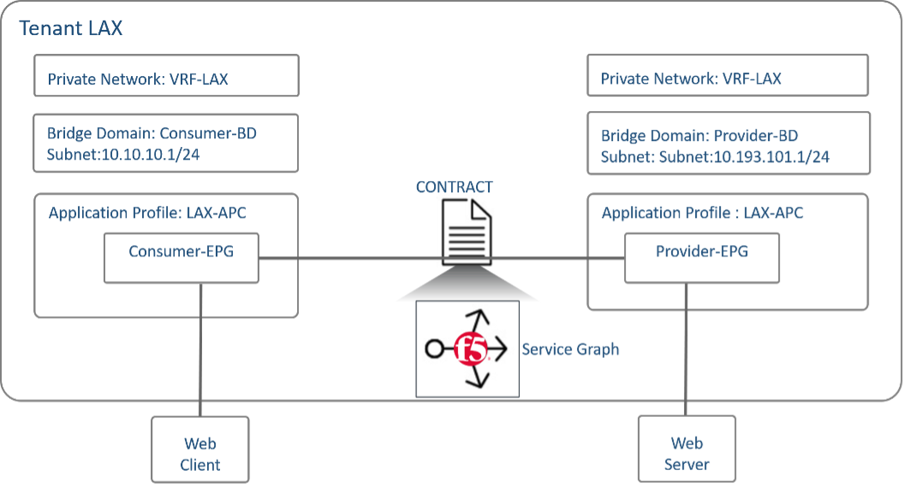

# Cisco ACI and F5 BIG-IP integration

This terraform module represents a common “Infrastructure as Code” scenario for provisioning and management of Cisco ACI and F5 BIG-IP on any private/multi/hybid infrastructure, with focus on:
- on-prem greenfield deployment
- with Cisco Service Graph (PBR)

Topology
-----------


Requirements
------------
- [Terraform](https://www.terraform.io/downloads.html) v0.11.7 +
- [Go](https://golang.org/doc/install) Latest Version

Using The Provider
------------
1. Run `terraform init` to initialize it.
2. Specify user values in a variable definitions file `terraform.tfvars`
```hcl
aci_username = "admin"
aci_password = "xxxxxxxx"
aci_url      = "https://198.18.133.200"

aci_tenant              = { name : "f5", description : "" }
aci_vmm_provider_dn     = "uni/vmmp-VMware"
aci_vmm_domain_name     = "My-vCenter"
aci_vmm_controller_name = "dCloud-DC"
aci_bigip_vm_name       = "BIGIP1-VM"
aci_bigip_device_name   = "BIGIP-VE-Standalone"
...
```
3. Run the plan and apply
```
terraform plan
terraform apply
```

Note : If you are facing the issue of `invalid character '<' looking for beginning of value` while running `terraform apply`, use signature based authentication in that case, or else use `-parallelism=1` with `terraform plan` and `terraform apply` to limit the concurrency to one thread.

```
terraform plan -parallelism=1
terraform apply -parallelism=1
```  
